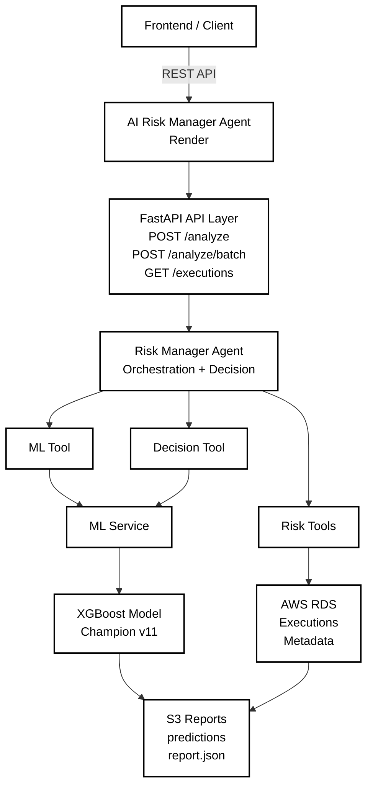

# LossLess Engine (AI Risk Manager) : Agent Layer

A production-grade fraud risk orchestration service that transforms machine learning predictions and transaction signals into explainable, auditable risk decisions.

---

## Overview

The AI Risk Manager Agent is the decision and orchestration layer between client applications and ML inference services. While the ML layer answers *"Is this transaction fraudulent?"*, the Agent answers *"What should the system do about it?"*

The Agent combines deterministic risk analysis, ML predictions, behavioral signals, transaction velocity patterns, and business policies into a unified risk decision framework. It operates as an independent, independently deployable service that coordinates multiple sources of evidence before committing to a fraud-risk action.

**Core responsibility:** Transform transaction context and ML probability scores into actionable risk decisions with full traceability and explainability.

---

## Why Separate Agent from ML?

Decoupling the Agent from the ML model provides critical operational benefits:

- **Independent scaling**: Risk logic and ML inference can evolve and scale separately
- **Model agnostic**: Business rules remain unchanged when the model is updated or swapped
- **Multi-signal analysis**: Combine ML predictions with deterministic rules and behavioral patterns
- **Failure safety**: ML service failures do not result in silent incorrect approvals
- **Auditability**: All decisions are traced with supporting evidence and triggered rules
- **Testability**: Risk logic and ML integration are tested independently

---

## Technology Stack

| Category | Technologies |
|----------|--------------|
| **Runtime** | Python 3.11 · FastAPI · Uvicorn |
| **Validation** | Pydantic · Type hints |
| **Persistence** | SQLAlchemy · PyMySQL · MySQL (AWS RDS) |
| **ML Integration** | HTTPX · REST-based XGBoost inference |
| **Artifact Storage** | AWS S3 · Presigned URLs |
| **Testing** | Pytest · Pytest-Asyncio |
| **Containerization** | Docker · Docker Hub |
| **Deployment** | Render |

---

## System Architecture



---

## Core Components

### Risk Analysis Tools

**Transaction Tool**: Evaluates transaction characteristics (amount, currency, merchant, location, device, channel).

**Customer History Tool**: Analyzes historical behavior patterns, average/max transaction amounts, and behavioral risk scoring.

**Velocity Tool**: Detects rapid transaction sequences and abnormal spending velocity for the customer.

**Anomaly Tool**: Flags statistical deviations from established customer patterns.

**Prediction Tool**: Integrates with the ML service to obtain fraud probability scores.

**Decision Tool**: Applies deterministic rules and business policies to combine evidence into a final risk action.

### Single Transaction Flow

1. Gather transaction metadata (amount, merchant, location, etc.)
2. Analyze customer history and behavioral baseline
3. Evaluate transaction velocity relative to customer patterns
4. Flag statistical anomalies
5. Request ML fraud probability from dedicated ML service
6. Apply decision rules and business policies
7. Return final risk action: **APPROVE** | **REVIEW** | **BLOCK**

### Batch Processing

- Accept multipart CSV uploads with multiple transactions
- Process transactions in parallel through the same risk pipeline
- Generate aggregated fraud statistics and per-transaction decisions
- Write results to S3 as downloadable reports
- Return presigned URLs for artifact access

---

## Project Structure

```
agent/
├── main.py                          # FastAPI application entrypoint
├── agent.py                         # Orchestration logic
│
├── schemas/
│   ├── request.py                   # API request models
│   └── response.py                  # API response models
│
├── tools/
│   ├── transaction_tool.py          # Transaction analysis
│   ├── customer_history_tool.py     # Customer behavior analysis
│   ├── velocity_tool.py             # Transaction velocity analysis
│   ├── anomaly_tool.py              # Anomaly detection
│   ├── prediction_tool.py           # ML service integration
│   ├── decision_tool.py             # Decision engine
│   └── batch_prediction_tool.py     # Batch processing
│
├── decision/
│   ├── risk_levels.py               # Risk level classifications
│   ├── risk_rules.py                # Deterministic decision rules
│   └── action_policy.py             # Business action policies
│
├── repositories/
│   ├── transaction_repository.py    # Transaction data access
│   ├── execution_repository.py      # Execution audit logging
│   └── execution_model.py           # Execution ORM models
│
├── prompts/
│   └── risk_manager.py              # Risk decision prompts
│
├── database.py                      # Database initialization
├── Dockerfile                       # Container specification
├── requirements.txt                 # Python dependencies
├── .env.example                     # Environment variable template
└── .gitignore
```

---

## Design Principles

1. **Separation of Concerns** : API, orchestration, tools, decision logic, and persistence are decoupled
2. **Model-Agnostic Business Logic** : Risk rules are independent of model implementation
3. **Explicit Service Boundaries** : Agent and ML service are independently deployable
4. **Fail-Safe Decisions** : ML service failures trigger safe defaults, never silent approvals
5. **Explainability** : Every decision includes supporting evidence and triggered rules
6. **Auditability** : Executions are persisted with complete metadata for compliance
7. **Scalability** : Single and batch workflows are logically separated for independent evolution
8. **Testability** : Tools and complete workflows are unit and integration tested

---

## Getting Started

### Prerequisites

- Python 3.11+
- Docker
- AWS credentials (RDS and S3)
- Deployed ML service endpoint (from AIRiskManagerML)

### Setup

```bash
# Clone repository
git clone https://github.com/Y-K-SAI-SRIKAR/AIRiskManagerAgent
cd AIRiskManagerML-Agent
pip install -r requirements.txt

# Configure environment
cp .env
# Edit .env with AWS credentials, RDS connection, ML service URL

# Run locally
python -m uvicorn agent.main:app --reload --port 8000
# API docs: http://localhost:8000/docs
```

### Docker Deployment

```bash
# Build image
docker build -t air-risk-agent:agent .

# Push to registry
docker push <registry>/air-risk-agent:agent

# Deploy to Render or Kubernetes
# Services expect environment variables for credentials and service endpoints
```

---

## API Endpoints

**Single Transaction Risk Assessment**

```http
POST /analyze
Content-Type: application/json

{
  "transaction_id": "txn_123",
  "amount": 250.00,
  "currency": "USD",
  "merchant": "ACME Corp",
  "customer_id": "cust_456",
  "location": "New York, NY",
  "device_id": "dev_789"
}

Response:
{
  "transaction_id": "txn_123",
  "risk_level": "LOW",
  "action": "APPROVE",
  "fraud_probability": 0.12,
  "evidence": {
    "customer_history": "positive",
    "velocity": "normal",
    "anomaly_score": 0.05
  },
  "triggered_rules": [],
  "timestamp": "2026-09-03T14:32:00Z"
}
```

**Batch Fraud Analysis**

```http
POST /batch-analyze
Content-Type: multipart/form-data

transactions.csv (multipart file upload)

Response:
{
  "batch_id": "batch_789",
  "total_transactions": 1000,
  "fraud_count": 12,
  "fraud_rate": 0.012,
  "report_url": "https://s3.amazonaws.com/...",
  "processing_time_seconds": 15.3
}
```

---

## Production Considerations

### Cold Start Handling

Services deployed on free-tier infrastructure may experience spin-down and subsequent cold-start latency. The Agent includes explicit HTTP timeout and retry logic for ML service communication.

For production workloads requiring strict latency SLAs, use always-on instances or appropriately sized dedicated infrastructure.

### Security

- **Secrets**: All credentials supplied via environment variables, never committed to source control
- **Data Handling**: Large datasets processed through S3 pipeline, not duplicated in RDS
- **Metadata Only**: Agent database contains only execution metadata, not raw transactions
- **Temporary Files**: Uploaded CSVs removed after processing
- **Presigned URLs**: Artifact access controlled through temporary S3 presigned URLs

### Monitoring

Track these metrics in production:

- API response latency and error rates
- ML service availability and response times
- Decision distribution (APPROVE / REVIEW / BLOCK)
- Fraud detection rate and false positive rate
- Database connection pool utilization

---

## Integration with ML Service

The Agent communicates with the deployed ML service via REST API:

```python
# Example integration
response = await ml_client.post(
    url="https://ml-service.url.com/predict",
    json={"features": transaction_features},
    timeout=5.0
)
fraud_probability = response.json()["fraud_probability"]
```

The ML service is intentionally external, allowing:
- Independent model updates without redeploying Agent
- Model versioning and A/B testing
- Horizontal scaling of inference independent of decision logic

---

## Testing

```bash
# Run unit tests
pytest tests/

# Run with coverage
pytest --cov=agent tests/

# Run async tests
pytest -v tests/ -m asyncio
```

---

## License

This project is licensed under the MIT License. see the [LICENSE](LICENSE) file for details.

---

**Maintained by:** YERRAGUNTLA KAMESWARA SAI SRIKAR
**Last Updated:** September 03, 2026.